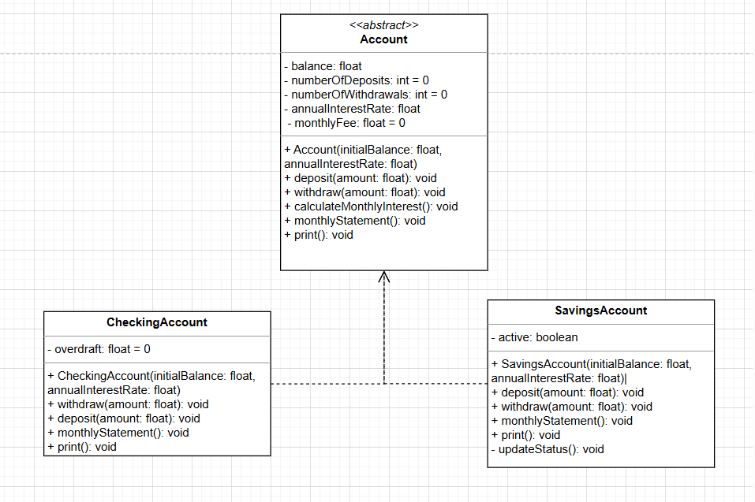
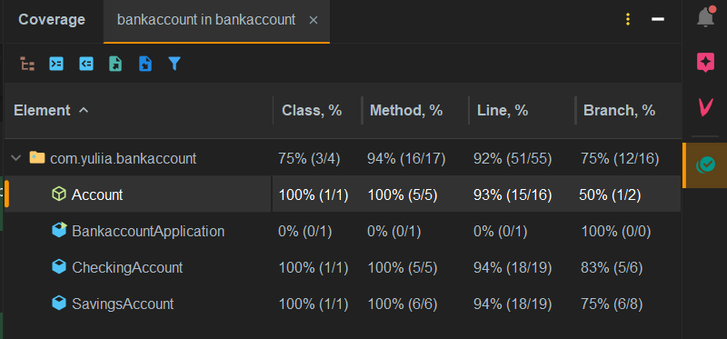

# Kata Cuenta Bancaria (*195)

## Descripción
Desarrollar un programa en Java que modele una cuenta bancaria con las siguientes características y requisitos:

### Atributos (Acceso Protegido)
- **Saldo**: `float`
- **Número de consignaciones**: `int`, valor inicial: `0`
- **Número de retiros**: `int`, valor inicial: `0`
- **Tasa anual** (porcentaje): `float`
- **Comisión mensual**: `float`, valor inicial: `0`

### Constructor
La clase `Cuenta` tiene un constructor que inicializa los atributos:
- `saldo`
- `tasa anual`  
  Los valores son pasados como parámetros.

---

## Métodos de la Clase `Cuenta`

1. **Consignar dinero:**  
   Actualiza el saldo al añadir la cantidad consignada.

2. **Retirar dinero:**  
   Actualiza el saldo al retirar la cantidad especificada.  
   Restricción: No se puede retirar más de lo que hay en el saldo.

3. **Calcular interés mensual:**  
   Calcula el interés mensual correspondiente y lo añade al saldo.

4. **Generar extracto mensual:**
    - Actualiza el saldo restándole la comisión mensual.
    - Calcula y aplica el interés mensual.

5. **Imprimir atributos:**  
   Retorna los valores de los atributos.

---

## Clases Hijas

### **Cuenta de Ahorros**
Posee un atributo adicional:
- **Activo** (`boolean`):
    - La cuenta está **inactiva** si el saldo es menor a `$10,000`.
    - La cuenta está **activa** si el saldo es mayor o igual a `$10,000`.

#### Métodos Redefinidos:
1. **Consignar dinero:**  
   Solo se puede consignar si la cuenta está activa. Este método invoca al método heredado.

2. **Retirar dinero:**  
   Solo es posible si la cuenta está activa. Este método invoca al método heredado.

3. **Generar extracto mensual:**
    - Si el número de retiros supera los 4, se cobra una comisión de `$1,000` por cada retiro adicional.
    - Actualiza el estado de la cuenta (activa o inactiva) basado en el saldo.

4. **Imprimir:**  
   Retorna los valores de:
    - Saldo actual
    - Comisión mensual
    - Número de transacciones realizadas (suma de consignaciones y retiros)

---

### **Cuenta Corriente**
Posee un atributo adicional:
- **Sobregiro** (`float`), inicializado en `0`.

#### Métodos Redefinidos:
1. **Retirar dinero:**
    - Permite retirar más del saldo disponible.
    - El exceso retirado se almacena como **sobregiro**.

2. **Consignar dinero:**
    - Invoca al método heredado.
    - Si existe un sobregiro, la cantidad consignada reduce este sobregiro.

3. **Generar extracto mensual:**  
   Invoca al método heredado.

4. **Imprimir:**  
   Retorna los valores de:
    - Saldo actual
    - Comisión mensual
    - Número de transacciones realizadas (suma de consignaciones y retiros)
    - Valor del sobregiro

### UML

### Cobertura del test

